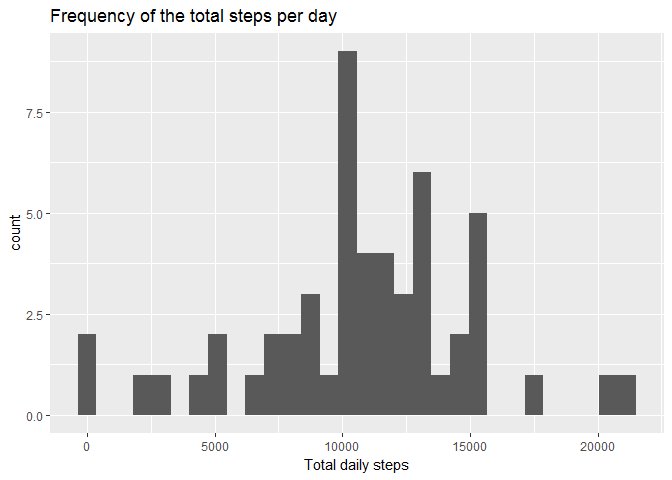
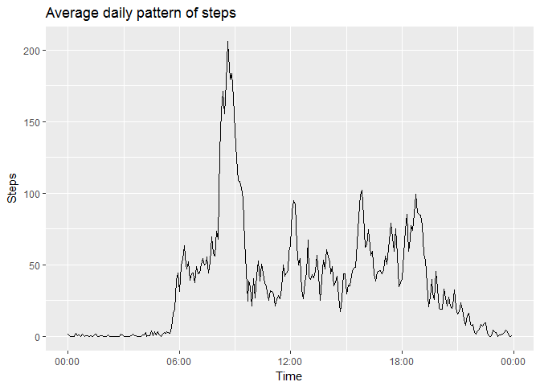
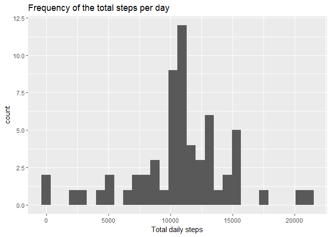
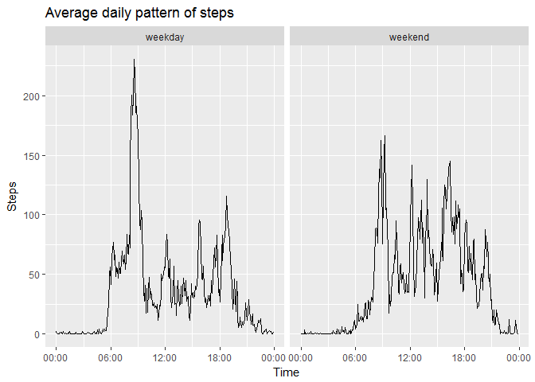

## Loading and preprocessing the data

First of all, necessary packages are loaded. Then Activity monitoring data is extracted and loaded.

```r
library(plyr)
library(magrittr)
library(ggplot2)

unzip("activity.zip")
activity <- read.csv("activity.csv")
```


## What is mean total number of steps taken per day?

The total number of steps for each day is calculated.

```r
daily.total <- with(activity, tapply(steps, date, sum))
daily.total <- as.data.frame(daily.total)
colnames(daily.total)[1] <- "steps"
```

Here is a histogram of the total number of steps taken each day.

```r
ggplot(data = daily.total, aes(steps)) +
  geom_histogram(bins = 30) +
  ggtitle("Frequency of the total steps per day") +
  xlab("Total daily steps")
```

<!-- -->

The mean of total number of steps taken per day is:

```r
daily.mean <- mean(daily.total$steps, na.rm = TRUE)
daily.mean
```

```
## [1] 10766.19
```

The median of total number of steps taken per day is:

```r
daily.median <- median(daily.total$steps, na.rm = TRUE)
daily.median
```

```
## [1] 10765
```


## What is the average daily activity pattern?

The calculation of the average number of steps taken, averaged across all days for each 5-minute interval is executed.

```r
daily.pattern <- activity %>%
  ddply(.(interval), summarize, avg.steps = mean(steps, na.rm = TRUE)) %>%
  mutate(time = sprintf("%04d", interval)) %>%
  mutate(time = as.POSIXct(time, format="%H%M"))
```

Here is the time-series plot of the daily activity pattern.

```r
ggplot(data = daily.pattern, aes(time, avg.steps)) +
  geom_line() +
  scale_x_datetime(date_label = "%H:%M") +
  ggtitle("Average daily pattern of steps") +
  xlab("Time") +
  ylab("Steps")
```

<!-- -->

The 5-minute interval containing the maximum number of steps starts with the following time:

```r
max.steps <- with(daily.pattern, time[which(avg.steps == max(avg.steps))])
format(max.steps,'%H:%M')
```

```
## [1] "08:35"
```


## Imputing missing values

The total number of missing values in the dataset is:

```r
missing.values <- sum(is.na(activity$steps))
missing.values
```

```
## [1] 2304
```

We replace missing values with average values of the particular interval from the daily pattern.

```r
na.ind <- which(is.na(activity$steps))
activity.na <- activity[na.ind,]
activity.na <- join(activity.na, daily.pattern[, c("interval", "avg.steps")],
                     by = "interval")
activity2 <- activity
activity2[na.ind, "steps"] <- activity.na$avg.steps
```

Here is the histogram of the total number of steps taken each day (data set with missing values replaced is used).

```r
daily.total2 <- with(activity2, tapply(steps, date, sum))
daily.total2 <- as.data.frame(daily.total2)
colnames(daily.total2)[1] <- "steps"
ggplot(data = daily.total2, aes(steps)) +
  geom_histogram(bins = 30) +
  ggtitle("Frequency of the total steps per day") +
  xlab("Total daily steps")
```

<!-- -->

The mean of total number of steps taken per day is:

```r
daily.mean2 <- mean(daily.total2$steps, na.rm = TRUE)
daily.mean2
```

```
## [1] 10766.19
```

The median of total number of steps taken per day is:

```r
daily.median2 <- median(daily.total2$steps, na.rm = TRUE)
daily.median2
```

```
## [1] 10766.19
```

The daily mean of steps has not changed from the initial data set, because
missing values were observed only for the whole day, not some particular
intervals in the day-time. Since we have replaced missing values with
average values of the particular interval from the daily pattern, we have got the total number of steps for missing days equal to the daily average of total
steps taken.

The daily median has changed from the initial data set.
Now it is equal to the daily mean.

## Are there differences in activity patterns between weekdays and weekends?

The data set is appended with a new factor variable `weekday`, which indicates
whether the observation belongs to the weekday or the weekend.

```r
activity2 <- activity2 %>%
  mutate(weekday = ifelse(weekdays(as.Date(date)) %in% c("Saturday", "Sunday"),
                          "weekend", "weekday")) %>%
  mutate(weekday = as.factor(weekday))
```

The daily pattern of average number of steps taken, averaged accross weekdays/weekends for each 5-minute interval is calculated.

```r
weekday.pattern <- activity2 %>%
  ddply(.(interval, weekday), summarize, avg.steps = mean(steps, na.rm = TRUE)) %>%
  mutate(time = sprintf("%04d", interval)) %>%
  mutate(time = as.POSIXct(time, format="%H%M"))
```

Here is the panel-plot, which shows the differences in activity patterns between
weekdays and weekends.

```r
ggplot(data = weekday.pattern, aes(time, avg.steps)) +
  geom_line() +
  facet_grid(. ~ weekday) +
  scale_x_datetime(date_label = "%H:%M") +
  ggtitle("Average daily pattern of steps") +
  xlab("Time") +
  ylab("Steps")
```

<!-- -->

We can observe that weekdays contain a visible peak in activity around 8-9AM,
while weekend pattern is more consistent taking into account the averaged total number of steps taken around 7AM - 9PM.

